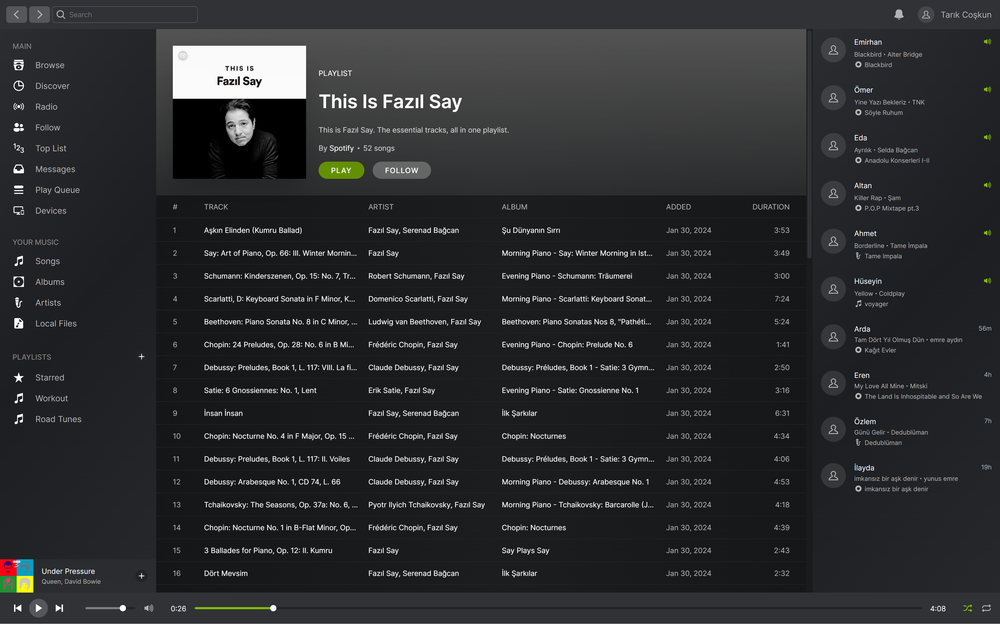

## Classic Spotify UI Clone

A clone of the classic Spotify UI made using Next.js

### Screenshots

<a href="https://old-spotify-clone.vercel.app">
  
  <em>Home page</em>
</a>

 

<a href="https://old-spotify-clone.vercel.app/artist">
  
  <em>Artist page</em>
</a>

 

<a href="https://old-spotify-clone.vercel.app/playlist">
  
  <em>Playlist page</em>
</a>
